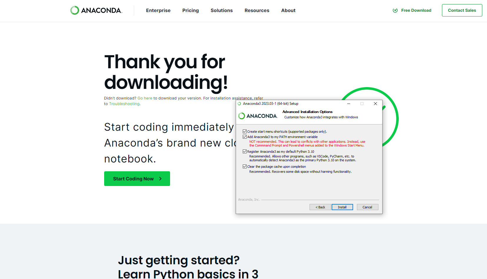

# Data Analytics/Data Science/Machine Learning Resources
This repository contains resources and step-by-step guide on learning data analytics, data science, and machine learning. `freeCodeCamp` has a lot of great videos, but this repo will give you an idea of which topics you should learn and in which order.

## Getting Started
### Recommended Textbook
[Pattern Recognition and Machine Learning by Christopher E. Bishop](https://github.com/peteflorence/MachineLearning6.867/blob/master/Bishop/Bishop%20-%20Pattern%20Recognition%20and%20Machine%20Learning.pdf)  
Download: Open the link and click the “Download raw file” button at the top right
### Python for Windows
It is recommended that you install [Anaconda](https://www.anaconda.com/download/success) - it comes with some of the most used Data Science and machine Learning packages
1. Download the Installer
2. Run the installer till this screen:

3. Check all the options - ignore the warning for “Add Anaconda3 to my PATH environment variable” (it is needed for python to run properly if you want to use a CLI other than anaconda prompt)

**I do NOT recommend using Anaconda Navigator - it can cause memory issues when training more complicated models**

### Jupyter Notebook
Most machine learning is done in IPython notebooks (`*.ipynb` files). You can create and access these files in 2 ways:
1. VSCode - Open VSCode, make a new file with the `.ipynb` extension
2. Jupyter Notebook
    a. Open anaconda prompt
    b. Type `jupyter notebook`
    c. Navigate to the desired folder
    d. New -> Python 3 (ipykernel)

Each cell in a notebook is called a **cell**  
The notebook instance is called the **kernel** - if you restart the kernel (or close and reopen), you will need to rerun all of your code  
On thee left, the `[]` refers to the order in which each cell was run
- `[]` means the cell has not been ran
- `[5]` means it is the 5th cell that was ran
- If you run a cell and it says `[5]`, but you have other cells with higher numbers, that means that those other cells have not been ran. Those cells were ran in a previous instance of your kernel.

***
***
## Outline
### 1. Manipulating Data in Python
- Basic Python
    - [Video](https://www.youtube.com/watch?v=rfscVS0vtbw) - I recommend watching the video up to the `Reading Files` section if you are new to Python. If you are already familiar with Python, then skip around to sections that you wish to review.
- `pandas`, IPython Notebooks, Data Preprocessing, and Data Cleaning
    - [Video Playlist](https://www.youtube.com/watch?v=ZyhVh-qRZPA&list=PLSLQ7uyfNIItZf404-TviaeM01pnebr5K) - This playlist will give you a quick rundown of the basic uses of the `pandas` library to manipulate data.
- Data Visualization with `matplotlib`
    - [Video](https://www.youtube.com/watch?v=3Xc3CA655Y4)
### 2. Basic Terminology (Chapter 1)
- Definitions and Key Terms:
    - Supervised/Unsupervised Learning
    - Features/Labels
    - Training/Test sets
    - Overfitting/Underfitting
### 3. Basic Probability Theory (Chapter 2)
- **Note**: These topics are crucial for understanding how machine learning models work - after all, machine learning is fundamentally based on probabilistic reasoning. While you may be able to build and use models without mastering all of these concepts, understanding them will allow you to grasp the "why" behind model behavior, improve your analytical skills, and fine-tune model performance more effectively.
- Probability Distributions
- Bayes' Theorem
- Expectation and Variance
### 4. Nearest Neighbors - Simple Supervised Learning
### 5. Linear Regression & Regularization - The Regression Problem (Chapter 3)
- Linear Regression
- Loss Functions
- Regularization
- L1 (Lasso) and L2 (Ridge) Regularization
- Elastic Net
- Bias-Variance Tradeoff
- Feature Selection
### Gradient Descent
- Stochastic Gradient Descent
- Mini-batch Gradient Descent
- Hyperparameter Tuning
### Logistic Regression - The Classification Problem (Chapter 4)
- Logistic Regression & Binary Classification
- Multiclass Classification
- Evaluation Metrics
- ROC Curves and AUC
### Support Vector Machines - SVMs (Optional)
### Principal Component Analysis - PCA (Chapter 12)
- Dimensionality Reduction
- Concept and Interpretation
### Clustering
- k-Means Clustering
- Hierarchical Clustering
- DBSCAN (Density-Based Spatial Clustering of Applications with Noise)
- Evaluating Results
### Tree-Based Models (Chapter 14)
- Decision Trees (Regression and Classification)
- Random Forests (Regression and Classification)
- Feature Importance
### Gradient Boosting (Chapter 14)
- Gradient Boosting Machines (GBMs)
- XGBoost (Regression and Classification)
- Grid Search (Hyperparameter Tuning)
### Neural Networks (Chapter 5)
- Neural Network concept
- Backpropagation and Training
- TensorFlow

## Other Useful Topics:
### Data Collection
- APIs
- JSON files
### SQL
- Basics of SQL Queries
- Joins, Aggregations, Subqueries
- Window Functions
### SQLAlchemy & ORMs
- Introduction to SQLAlchemy
- ORM Concepts
- Connecting to Databases
### Navigating in CLIs
- Basic CLI Commands
- File Management
- Version Control (git)
### NoSQL
- Document Stores (MongoDB)
